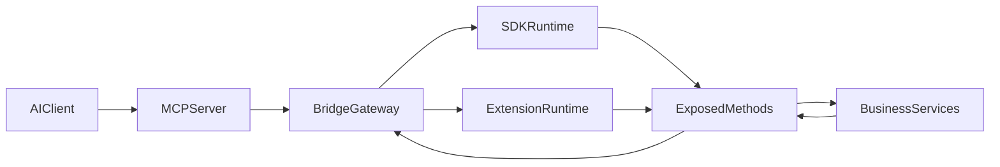
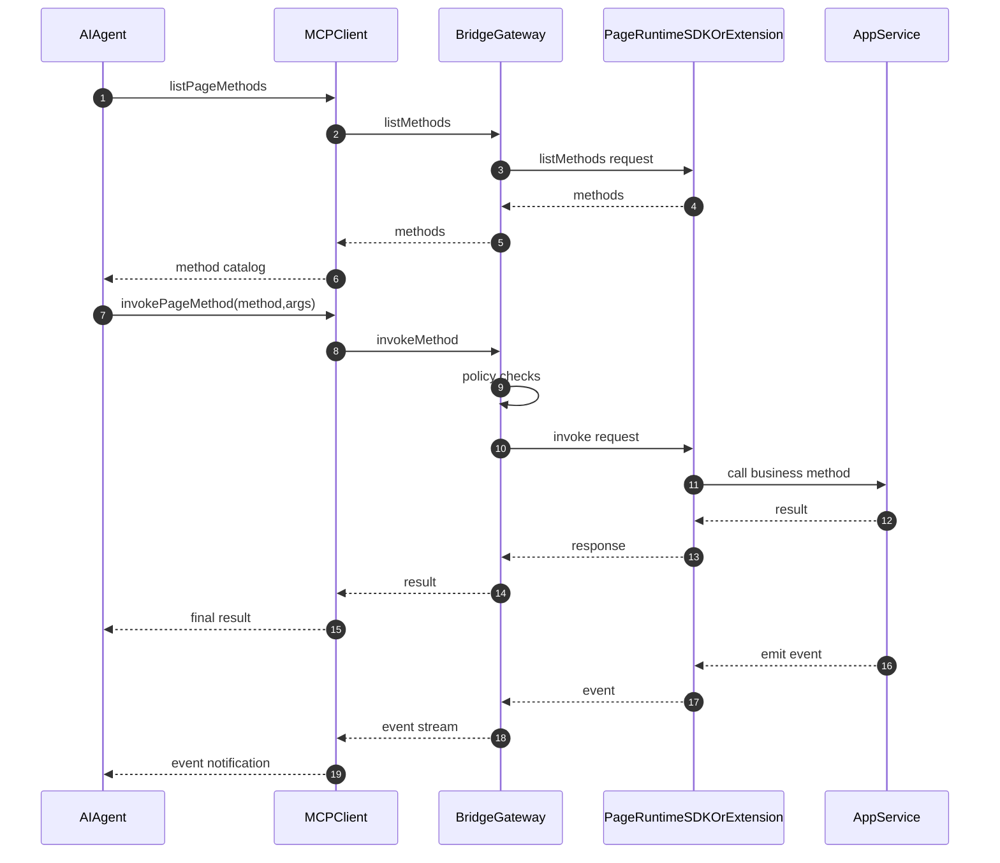
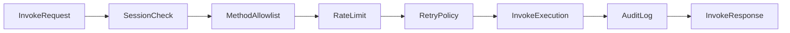

# Web-native MCP Architecture

## Purpose

This framework allows AI agents to invoke browser page methods directly through MCP tools, instead of relying on flaky DOM click automation.

## Core Components

- `@web-native-mcp/protocol`: shared message contracts and runtime validation.
- `@web-native-mcp/mcp-server`: MCP tool host + WebSocket bridge gateway.
- `@web-native-mcp/web-bridge-sdk`: in-page runtime for explicit method exposure.
- `@web-native-mcp/extension-bridge`: legacy-friendly extension path using global method mapping.
- `@web-native-mcp/adapters`: helper adapters for fast migration (React first).

## System Architecture

## End-to-End Interaction

## Security and Governance Controls

Current defaults implemented in this repository:

1. Explicit `sessionId` is required when multiple sessions are connected.
2. Mutating methods do not retry by default.
3. Invocation is rate-limited per session and method.
4. Token auth prefers WebSocket subprotocol; query token can be disabled.
5. Extension bridge validates `origin` and `channelSecret`.

## Design Choices

- **Protocol-first**: all modes share one message contract and version.
- **Hybrid onboarding**: SDK mode (explicit, safer) + extension mode (faster retrofit).
- **Policy-driven security**: auth token, origin allowlist, method allowlist.
- **Operational visibility**: JSON audit logs with trace ids and durations.
